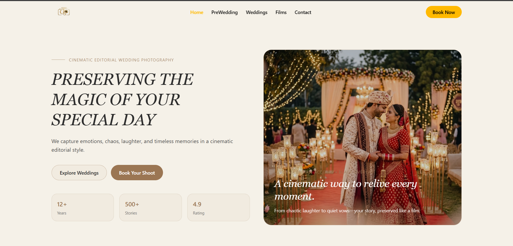

# The Golden Shutter

A modern wedding photography booking platform with elegant gallery, booking management, and seamless user experience.
## Screenshot



## Tech Stack

**Frontend:** React 19, Vite, Tailwind CSS, Axios
**Backend:** Node.js, Express 5, MongoDB (Mongoose), Cloudinary, Nodemailer

## Quick Start

### Prerequisites
- Node.js v16+
- npm v8+
- MongoDB connection string
- Cloudinary account

### Installation

```bash
# Navigate to project
cd "c:\PROJECTS\the golden Shutter\THE GOLDEN SHUTTER"

# Backend setup
cd backend
npm install

# Frontend setup
cd ../frontend
npm install
```

### Running

**Backend** (runs on http://localhost:5000):
```bash
cd backend
npm start
```

**Frontend** (runs on http://localhost:5173):
```bash
cd frontend
npm run dev
```

### Production Build
```bash
cd frontend
npm run build
```

## Color Palette

### Root CSS Variables (frontend/src/index.css)
- `--bg`: #000000 (Black - Main background)
- `--text`: #FFFFFF (White - Primary text)
- `--card`: #1F2124 (Dark Gray - Card backgrounds)
- `--border`: #69727D (Gray - Borders and inputs)
- `--overlay-30`: rgba(0, 0, 0, 0.3) (30% dark overlay)
- `--overlay-10`: rgba(0, 0, 0, 0.1) (10% dark overlay)

### Brand Colors (Used throughout)
- `#F5F1E8` (Light Cream - Secondary background)
- `#9B7653` (Golden Brown - Accent/Primary)
- `#2C2C2C` (Dark Charcoal - Text)
- `#6A6A6A` (Medium Gray - Secondary text)
- `#4A4A4A` (Dark Gray - Tertiary text)

## Scripts

| Command | Purpose |
|---------|---------|
| `npm start` (backend) | Start API server |
| `npm run dev` | Start frontend dev server |
| `npm run build` | Build for production |
| `npm run lint` | Run ESLint |

## API Endpoints

- `/api/auth` - Authentication
- `/api/gallery` - Gallery images
- `/api/weddings` - Wedding collections
- `/api/bookings` - Booking management
- `/api/contact` - Contact form

## Environment Setup

Create `.env` in backend folder:

```env
PORT=5000
CLIENT_ORIGIN=http://localhost:5173
MONGO_URI=your_mongodb_connection_string
CLOUDINARY_CLOUD_NAME=your_cloud_name
CLOUDINARY_API_KEY=your_api_key
CLOUDINARY_API_SECRET=your_api_secret
EMAIL_USER=your_email@gmail.com
EMAIL_PASSWORD=your_app_password
```

## Features

- Responsive gallery with masonry layout
- Booking management system
- Email notifications
- Cloudinary image optimization
- Authentication system
- Modern UI with Tailwind CSS

